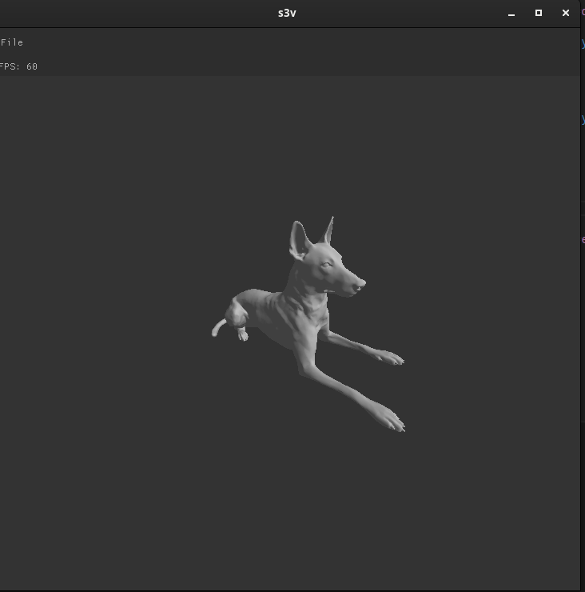
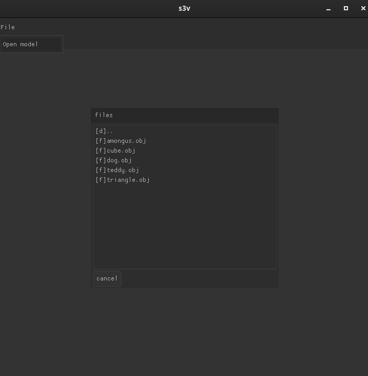

# simple-3d-viewer
A very simple 3D mesh renderer written in C.

<div align="center">
  
</div>

<!-- TABLE OF CONTENTS -->
<details>
  <summary>Table of Contents</summary>
  <ol>
    <li>
      <a href="#about-the-project">About The Project</a>
      <ul>
        <li><a href="#built-with">Built With</a></li>
      </ul>
    </li>
    <li>
      <a href="#getting-started">Getting Started</a>
      <ul>
        <li><a href="#prerequisites">Prerequisites</a></li>
        <li><a href="#build">Build</a></li>
      </ul>
    </li>
    <li><a href="#usage">Usage</a></li>
  </ol>
</details>

<!-- ABOUT THE PROJECT -->
## About The Project

S3V is very simple 3D Viewer written in C.
It supports single mesh Wavefront .obj files.

### Built With

This section should list any major components used in this project.
All the code should be included in this repo, under the ```dependencies``` folder.

* [GLFW](https://www.glfw.org/)
* [OpenGL](https://www.opengl.org/)
* [glad](https://github.com/Dav1dde/glad), an OpenGL loader
* [Nuklear](https://github.com/Immediate-Mode-UI/Nuklear), an immediate mode ui rendering library.

<!-- GETTING STARTED -->
## Getting Started

### Prerequisites

Compiling S3V requires `gcc` and `cmake`.

1. Install the basic tools
* Arch Linux
  ```sh
  # pacman -S gcc cmake
  ```

### Compiling

1. Clone the repo
   ```sh
   $ git clone https://github.com/nflsilva/s3v.git
   ```

2. Navigate into s3v directory and build the application
   ```sh
   $ cd s3v
   $ mkdir build
   $ cd build
   $ cmake ..
   $ make
   ```

### Usage
Simply run
   ```sh
   $ ./s3v
   ```
and then, select ```File->Open Model``` and select a ```.obj``` file.
Use the ```right-mouse button``` to rotate the model.

<div id="top"></div>
<br />
<div align="center">
  
</div>

## What's next
This renderer needs way more features. These are some of the planned ones in no particular order:
- Support multiple mesh models;
- Support materials and textures;
- Support negative index Wavefont files;
- Support multiple platforms;
- Support model animations;
- Support for *on the fly* shader loading;
- Improve file loading performance.
